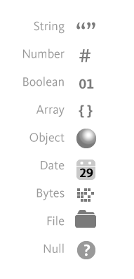

# VS Code : Transformer ses données avec Data Wrangler

---

## Insaller l'extension Data Wrangler dans VS Code

---

## Scénario

---

## Charger des données

 ---

## Supprimer des colonnes

---

## Changer le type d'une colonne

---

## Utiliser GitHub Copilot

---

## Générer le code Python

---

## Exporter les données transformées

